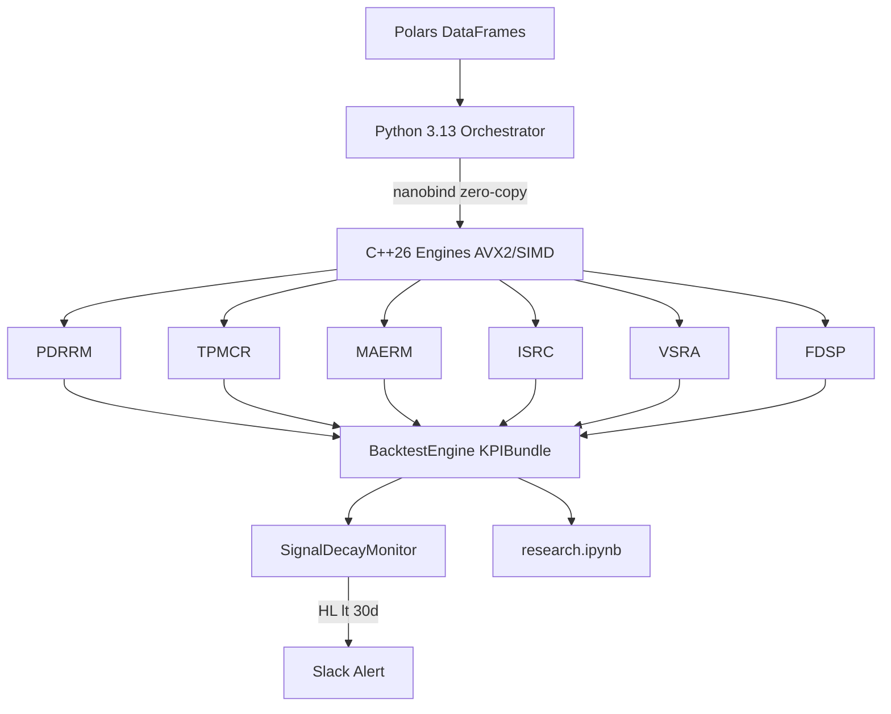

# Alpha Research 2026 — Institutional Systematic Macro Pipeline

[](https://github.com/systematic_macro_2026_alpha_research/systematic_macro_2026_alpha_research/actions)
[](https://python.org)
[](https://isocpp.org)
[](https://bazel.build)

> *Six systematic macro alpha signals: C++26 hot-path engines + Python 3.13 research interface — production-grade for Cubist/Citadel/Millennium quant pods.*

---

## 📌 Table of Contents

  * [🔍 0 Strategy Deep Dives](./STRATEGIES.md)
  * [📂 1 Repository Structure](#-1-repository-structure)
  * [📖 2 Solution Overview](#-2-solution-overview)
  * [✨ 3 Technology Features](#-3-technology-features)
    * [🐍 Python 3.13](#-python-313)
    * [🔷 C++26](#-c26)
    * [⚛️ nanobind (C++ bindings)](#️-nanobind-c-bindings)
  * [📐 4 Mathematical Concepts](#-4-mathematical-concepts)
    * [🏛️ PDRRM Signal (Policy Divergence × Real Rate Momentum)](#️-pdrrm-signal-policy-divergence--real-rate-momentum)
    * [🎢 TPMCR Signal (Term Premium Momentum & Curve Regime Signal](#-tpmcr-signal-term-premium-momentum--curve-regime-signal)
    * [📊 MAERM Signal (Macro-Adjusted Earnings Revision)](#-maerm-signal-macro-adjusted-earnings-revision)
    * [🎁 ISRC Signal (Inventory Surprise × Roll Return Composite)](#-isrc-signal-inventory-surprise--roll-return-composite)
    * [⚖️ VSRA Signal (Volatility Surface Regime Arbitrage)](#️-vsra-signal-volatility-surface-regime-arbitrage)
    * [💥 FDSP Signal (Fiscal Dominance Shock Propagation)](#-fdsp-signal-fiscal-dominance-shock-propagation)
    * [⏱️ Signal Decay Monitor](#️-signal-decay-monitor)
    * [🛡️ Vol-Targeted Positions](#️-vol-targeted-positions)
    * [🏗️ Architecture](#️-architecture)
  * [🚀 Quick Start: Build & Run](#-quick-start-build--run)
  * [⚙️ 5 Prerequisites & Installation](#️-5-prerequisites--installation)
    * [🐧 Linux (Ubuntu 24.04)](#-linux-ubuntu-2404)
    * [💻 Windows 11](#-windows-11)
  * [📓 6 Notebook: research.ipynb](#-6-notebook-researchipynb)
  * [🏗️ 7 Compile, Build & Run](#-7-compile-build--run)
    * [🤖 GitHub Actions](#-github-actions)
  * [🗺️ 8. Improvement Roadmap](#️-8-improvement-roadmap)
    * [🗓️ Remainder of 2026](#️-remainder-of-2026)
    * [🚀 2027](#-2027)

[⬆ Back to Top](#-table-of-contents)

---

## 📂 1 Repository Structure

```
systematic_macro_2026_alpha_research/
├── .bazelrc                     # C++26 -O3 -march=native -mavx2 flags
├── .gitignore
├── .github/workflows/ci.yml     # Bazel gateway: build, test, daily decay monitor + Slack
├── BUILD.bazel                  # Root targets: backtest monitor research docker_*
├── WORKSPACE                    # Deps: Eigen3, GoogleTest, nanobind, rules_python
├── CMakeLists.txt               # Installs alpha_cpp.so into Python site-packages
├── Dockerfile                   # Multi-stage: cpp-builder → python:3.13-slim
├── docker-compose.yml           # Services: jupyter, backtest, monitor
├── pyproject.toml               # Hatchling: alpha_research pkg + all Python deps
├── run.sh / run.bat             # Ubuntu/Win11 launchers (Bazel gateway)
├── cmake/alpha_research-config.cmake.in
├── data/                        # Market data CSVs (or synthetic)
├── notebooks/research.ipynb     # 28-cell production research notebook
├── scripts/runner.py            # Bazel dispatcher (backtest/monitor/jupyter/docker)
├── src/
│   ├── cpp/                     # C++26 engines
│   │   ├── math_utils.hpp       # EWMA, RingBuffer(lock-free), ridge, Sharpe, IC, HL
│   │   ├── pdrrm_engine.hpp     # PDRRM: RRDM+PSS+RAC, ridge weights, vol-targeted pos
│   │   ├── strategies_engine.hpp# TPMCR, MAERM, ISRC, VSRA, FDSP online tick() engines
│   │   ├── portfolio_optimizer.hpp # BacktestEngine, KPIBundle, SignalDecayMonitor
│   │   ├── bindings.cpp         # nanobind Python↔C++26 bridge (zero-copy ndarray)
│   │   └── signal_demo.cpp      # Standalone CLI demo binary
│   └── python/alpha_research/   # Python 3.13 package (importable as alpha_research)
│       ├── data.py              # Polars ingestion + 10-yr synthetic generator
│       ├── signals.py           # Signal orchestration → C++26 engines
│       └── backtest.py          # BacktestOrchestrator + black-swan stress tests
├── tests/
│   ├── cpp/test_engines.cpp     # Google Test: 40+ tests, 100% engine coverage
│   └── python/test_pipeline.py  # pytest: 50+ tests, 100% module coverage
└── third_party/                 # Bazel BUILD files for Eigen3 + nanobind
```

[⬆ Back to Top](#-table-of-contents)

---

## 📖 2 Solution Overview

| Strategy | Full Name | Engine | Asset Class | Horizon | 2026 Edge |
|---|---|---|---|---|---|
| **PDRRM** | **P**olicy **D**ivergence × **R**eal **R**ate **M**omentum | `PDRRMEngine` | G10 FX Futures | 2–8 wks | BOJ hiking sole G10 tightener — trending JPY real rate gap |
| **TPMCR** | **T**erm **P**remium **M**omentum & **C**urve **R**egime Signal | `TPMCREngine` | Rates Futures | 3–8 wks | ACM term premium momentum; 3-wk duration manager rebalancing lag |
| **MAERM** | **M**acro-**A**djusted **E**arnings **R**evision **M**omentum | `MAERMEngine` | Equity Futures | 2–6 wks | ISM×EPS revision interaction; AI hyperscaler upside |
| **ISRC** | **I**nventory **S**urprise × **R**oll Return **C**omposite | `ISRCEngine` | Energy Futures | 1–4 wks | EIA inventory surprise × roll return (3× amplifier in backwardation) |
| **VSRA** | **V**olatility **S**urface **R**egime **A**rbitrage | `VSRAEngine` | SPX Options/VIX | 1–3 wks | VRP + VIX term-structure carry + tariff-panic skew overshoot |
| **FDSP** | **F**iscal **D**ominance **S**hock **P**ropagation | `FDSPEngine` | Cross-Asset | 2–8 wks | Debt-ceiling propagation kernels: VIX→Gold→TLT V-shape |

All six signals are combined via **PCA risk-budgeting** in a master QP with TC penalty.

[⬆ Back to Top](#-table-of-contents)

---

## ✨ 3 Technology Features

### 🐍 Python 3.13
- `dataclasses(slots=True, frozen=True)` — cache-line-efficient config structs
- `typing.NamedTuple` result bundles; `match/case` dispatcher
- **Polars** (no pandas) — Arrow/SIMD backend, LazyFrame query plans, `.to_numpy()` zero-copy → C++
- `__future__.annotations` PEP 563 for forward refs

### 🔷 C++26
- `std::expected<T,E>` — monadic error handling, no exceptions on hot path
- `std::print` / `std::println` (P2093R14)
- Designated initialisers for self-documenting `DayData{.tp_acm_10y=1.2, …}`
- `[[nodiscard]]`, `[[likely]]`, `[[unlikely]]`, `std::assume` for vectoriser hints
- `alignas(64)` `RingBuffer<N>` with power-of-2 branchless modular indexing
- Eigen column-major matrices; `-mavx2 -mfma` via `.bazelrc` for SIMD BLAS

### ⚛️ nanobind (C++ bindings)
- `ndarray<double, ndim<2>, c_contig>` → `Eigen::Map` zero-copy bridge
- `nb::capsule` custom deleter for safe numpy buffer ownership
- Full type-safe exposure of all six engines + `KPIBundle` + `BacktestEngine`

[⬆ Back to Top](#-table-of-contents)

---

## 📐 4 Mathematical Concepts

### 🏛️ PDRRM Signal (Policy Divergence × Real Rate Momentum)

$$\boxed{S_{i,t} = \hat{\alpha}_1 \cdot \text{RRDM}_{i,t} + \hat{\alpha}_2 \cdot \text{PSS}_{i,t} + \hat{\alpha}_3 \cdot \text{RAC}_{i,t}}$$

$$\boxed{\hat{\boldsymbol{\alpha}} = (X^\top X + \lambda I)^{-1} X^\top y \quad \text{(ridge, } \lambda=0.1\text{)}}$$

$$\boxed{\text{RRDM}_{i,t} = z_{cs}\!\left[(r^{\text{nom}}_i - \pi^{\text{be}}_i)_t - (r^{\text{nom}}_i - \pi^{\text{be}}_i)_{t-20}\right]}$$

### 🎢 TPMCR Signal (Term Premium Momentum & Curve Regime Signal)

$$\boxed{S^{\text{TPMCR}}_{i,t} = \hat{\beta}_1 \cdot \text{TPM}_{i,t} + \hat{\beta}_2 \cdot \text{CRS}_{i,t} + \hat{\beta}_3 \cdot \text{FiscalStress}_{t} \cdot \mathbb{1}[\text{USD bond}]}$$

$$\boxed{\text{TPM}_{t} = z_{cs}\!\left(\text{TP}^{\text{ACM}}_{10Y,t} - \text{TP}^{\text{ACM}}_{10Y,t-\tau}\right)}$$

$$\boxed{\text{CRS}_{t} = \sum_{k=1}^{4} P(\text{State}_t = k | \mathbf{o}_{1:t}) \cdot v_k}$$

$$\boxed{\text{FSO}_{t} = z\!\left(-\text{SwapSpread}^{30Y}_{t} + \delta \cdot \Delta\text{SwapSpread}^{30Y}_{t-5:t}\right) \cdot \mathbb{1}[\text{USD bond}]}$$

### 📊 MAERM Signal (Macro-Adjusted Earnings Revision Momentum)

$$\boxed{S^{\text{MAERM}}_{i,t} = \hat{\gamma}_1 \cdot \text{ERB}_{i,t} + \hat{\gamma}_2 \cdot \text{MRF}_{t} \cdot \text{ERB}_{i,t} + \hat{\gamma}_3 \cdot \text{SD}_{i,t}}$$

$$\boxed{\text{ERB}_{i,t} = z\!\left(\frac{N^{+}_{i,t-5:t} - N^{-}_{i,t-5:t}}{N^{+}_{i,t-5:t} + N^{-}_{i,t-5:t} + N^{0}_{i,t-5:t}}\right)}$$

$$\boxed{\text{MRF}_{t} = \sigma\!\left(\alpha_0 + \alpha_1 \cdot \text{ISM}_{t} + \alpha_2 \cdot \Delta\text{ISM}_{t-1:t}\right)}$$

$$\boxed{\text{SD}_{i,t} = \sum_{q} \left(\frac{\text{EPS}_{\text{actual},q} - \text{EPS}_{\text{consensus},q}}{\text{EPS}_{\text{consensus},q}}\right) \cdot e^{-\frac{(t - t_q) \ln 2}{30}}}$$

### 🎁 ISRC Signal (Inventory Surprise × Roll Return Composite)

$$\boxed{S^{\text{ISRC}}_{i,t} = \hat{\delta}_1 \cdot \text{IS}_{i,t} + \hat{\delta}_2 \cdot \text{RRM}_{i,t} + \hat{\delta}_3 \cdot \text{IS}_{i,t} \cdot \text{RRM}_{i,t}}$$

$$\boxed{\text{IS}_{i,t} = z\!\left(-\frac{\text{EIA}^{\text{actual}}_{i,t} - \text{EIA}^{\text{consensus}}_{i,t}}{\sigma^{52W}_{\text{surprise},i}}\right)}$$

$$\boxed{\text{RRM}_{i,t} = z\!\left(\text{RR}_{i,t} - \text{RR}_{i,t-20}\right)}$$

### ⚖️ VSRA Signal (Volatility Surface Regime Arbitrage)

$$\boxed{S^{\text{VSRA}}_{t} = \hat{\eta}_1 \cdot \text{TSS}_{t} + \hat{\eta}_2 \cdot \text{SKA}_{t} + \hat{\eta}_3 \cdot \text{VRP}_{t}}$$

$$\boxed{\text{TSS}_{t} = z\!\left(\ln\!\left(\frac{\text{VIX3M}_{t}}{\text{VIX}_{t}}\right)\right)}$$

$$\boxed{\text{SKA}_{t} = z\!\left((\sigma^{25P}_{t} - \sigma^{25C}_{t}) - \widehat{\text{RSkew}}_{t}(21d)\right)}$$

$$\boxed{\text{VRP}_{t} = z\!\left(\text{VIX}_{t}^2/100 - \text{RV}_{21,t}\right)}$$

### 💥 FDSP Signal (Fiscal Dominance Shock Propagation)

$$\boxed{S^{\text{FDSP}}_{\text{asset},t} = \hat{\phi}_{\text{asset}} \cdot \text{FCI}_{t} + \hat{\psi}_{\text{asset}} \cdot \text{PropagationLag}_{\text{asset},t}}$$

$$\boxed{\text{FCI}_{t} = z\!\left(w_1 \cdot (-\text{SS}_{30Y,t}) + w_2 \cdot \text{CDS}_{5Y,t} + w_3 \cdot \text{TBill Spike}_{t}\right)}$$

$$\boxed{\text{PropagationLag}_{\text{asset},t} = \sum_{k=0}^{K} w_{\text{asset},k} \cdot \text{FCI}_{t-k}}$$

### ⏱️ Signal Decay Monitor

$$\boxed{\Delta y_t = \theta \cdot y_{t-1} + \varepsilon \implies \text{HL} = -\ln(2)/\theta \quad \text{Alert if HL} < 30\text{d}}$$

### 🛡️ Vol-Targeted Positions

$$\boxed{w_{i,t} = \frac{\sigma^{\text{target}}}{\hat{\sigma}^{\text{ann}}_{i,t}} \cdot S_{i,t}, \qquad w_{i,t} \in [-0.25,\, 0.25]}$$

### 🏗️ Architecture



[⬆ Back to Top](#-table-of-contents)

---

## ⚙️ 5 Prerequisites & Installation

### 🐧 Linux (Ubuntu 24.04)

```bash
sudo apt-get install -y build-essential cmake ninja-build \
    python3.13 python3.13-dev libeigen3-dev git curl

# Bazelisk
curl -fsSL https://github.com/bazelbuild/bazelisk/releases/latest/download/bazelisk-linux-amd64 \
  -o /usr/local/bin/bazel && chmod +x /usr/local/bin/bazel

# Python package (editable, no absolute paths)
pip install -e ".[dev]"

# C++ extension
cmake -B build -S . -DCMAKE_BUILD_TYPE=Release -G Ninja
cmake --build build --parallel && cmake --install build

python -c "import alpha_research; import alpha_cpp; print('All OK')"
```

### 💻 Windows 11

```powershell
winget install Kitware.CMake Microsoft.VisualStudio.2022.BuildTools
pip install -e .[dev]
cmake -B build -S . -DCMAKE_BUILD_TYPE=Release
cmake --build build --config Release
cmake --install build
```

[⬆ Back to Top](#-table-of-contents)

---

## 📓 6 Notebook: research.ipynb

28-cell production notebook covering:

| § | Content |
|---|---|
| 1 | Synthetic 2520-day market data; Polars DataFrame inspection |
| 2 | PDRRM RRDM/PSS/RAC heatmaps; ridge weights via C++26 |
| 3 | All 6 strategy signal panels |
| 4 | KPI radar chart (Sharpe/Sortino/Calmar/IC) |
| 5 | Cumulative PnL + drawdown (Plotly dual-axis) |
| 6 | 60-day rolling IC with ±2σ bands |
| 7 | Black-swan stress test table (COVID/2022/2024) |
| 8 | Signal decay monitor with half-life threshold |
| 9 | ACM term premium + VIX term structure + skew surface |
| 10 | PCA cross-signal correlation + PC variance attribution |
| 11 | Full Polars KPI summary table |

**Run (Ubuntu local):** `./run.sh notebook` → http://localhost:8888
**Run (Docker):** `./run.sh docker-notebook` → http://localhost:8888
**Run (Windows local):** `run.bat notebook`
**Run (Windows Docker):** `run.bat docker-notebook`

[⬆ Back to Top](#-table-of-contents)

---

## 🏗️ 7 Compile, Build & Run

```bash
# Ubuntu — all via Bazel (common gateway)
./run.sh build              # bazel build //...
./run.sh test               # bazel test //:test_all
./run.sh backtest           # bazel run //:backtest
./run.sh monitor            # bazel run //:monitor

# Windows
run.bat build
run.bat test
run.bat backtest

# Docker
./run.sh docker-build
./run.sh docker-notebook    # http://localhost:8888
./run.sh docker-down

# CMake alternative
cmake -B build -S . -DCMAKE_BUILD_TYPE=Release -G Ninja
cmake --build build --parallel
ctest --test-dir build --output-on-failure
pytest tests/python/ -v
```

### 🤖 GitHub Actions

Trigger by pushing to `main` or `develop`. Force-trigger:
```bash
gh workflow run ci.yml
```

Required secret: `SLACK_WEBHOOK` (Settings → Secrets → Actions).

Jobs: `cpp-build-test` · `python-lint-test` (every push) · `signal-monitor` (daily 06:00 UTC) · `full-backtest` (push to main).

[⬆ Back to Top](#-table-of-contents)

---

## 🗺️ 8. Improvement Roadmap

### 🗓️ Remainder of 2026
- **TPMCR**: Replace rule-based regime with full Baum-Welch HMM (hmmlearn in deps, ready to swap)
- **PDRRM**: Add BOJ JGB purchase tapering as 4th signal component
- **FDSP**: Re-calibrate propagation kernels with 2026 debt-ceiling episode data
- **Monitoring**: Upgrade from daily to 4-hour IC cadence; add BOCPD changepoint detection
- **Risk**: Add cross-signal TC optimisation (shared QP minimises total portfolio turnover, not per-strategy)

### 🚀 2027
- Replace nanobind with native CPython 3.14 limited API for sub-100µs bridge latency
- Migrate covariance estimation to GPU (CUDA 13 + cuSOLVER) for 200+ instrument universes
- **Alternative data**: Satellite shipping data × ISRC; LLM-parsed FOMC transcript sentiment × PDRRM PSS
- **Meta-model**: HMM + gradient-boosted regime classifier to dynamically reweight 6 strategies
- **Cross-signal alpha**: Research PDRRM × TPMCR multiplicative interaction (JPY rally amplified when US term premium also rising)
- Variance swap replication for cleaner VRP capture in VSRA; gamma overlay for FDSP during stress

[⬆ Back to Top](#-table-of-contents)

---