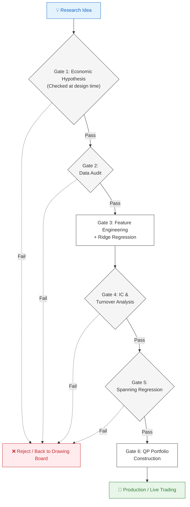

# 🎯 Six Alpha Strategies for Q2–Q4 2026

## *Cross-Asset Systematic Macro — Cubist-Grade Research Dossier*

## *Futures · Fixed Income · Equities · Options · Cross-Asset · G10 FX*

---

> **Feynman Framing:** *"The best trades aren't about predicting the future — they're about identifying where the market is still pricing the past. In Q2–Q4 2026, structural mispricings are crystallising simultaneously across asset classes, including fiscal stress, asynchronous CB cycles, tariff-regime uncertainty, and AI-driven earnings bifurcation."*

---

## 📌 Table of Contents

  * [⛩️ 6-Gate framework](#️-6-gate-framework)
    * [🚪 Gate 1: Economic Hypothesis](#-gate-1-economic-hypothesis)
    * [🚪 Gate 2: Data Sources](#-gate-2-data-sources)
    * [🚪 Gate 3: Feature Engineering](#-gate-3-feature-engineering)
      * [3.1 ACM Term Premium Momentum (TPM)](#31-acm-term-premium-momentum-tpm)
      * [3.2 Curve Regime Score (CRS)](#32-curve-regime-score-crs)
      * [3.3 Fiscal Stress Overlay (FSO)](#33-fiscal-stress-overlay-fso)
      * [3.4 Composite Signal](#34-composite-signal)
    * [🚪 Gate 4: IC & Performance Targets](#-gate-4-ic--performance-targets)
    * [🚪 Gate 5: Spanning Regression](#-gate-5-spanning-regression)
    * [🚪 Gate 6: Risk Architecture](#-gate-6-risk-architecture)
  * [🗃️ Table of Strategies](#️-table-of-strategies)
  * [🏛️ Strategy 1: **PDRRM**](#️-strategy-1-pdrrm)  
    * [**PDRRM** Signal (**P**olicy **D**ivergence × **R**eal **R**ate **M**omentum)](#pdrrm-signal-policy-divergence--real-rate-momentum)
      * [**PDRRM** - Executive Summary](#pdrrm---executive-summary)
      * [**PDRRM** - 2026 Macro Thesis & Feature Engineering](#pdrrm---2026-macro-thesis--feature-engineering)
      * [**PDRRM** - Portfolio Integration & Risk (Gate 5 & 6)](#pdrrm---portfolio-integration--risk-gate-5--6)
  * [🎢 Strategy 2: TPMCR](#-strategy-2-tpmcr)
    * [**TPMCR** Signal (**T**erm **P**remium **M**omentum & Yield **C**urve **R**egime Signal)](#tpmcr-signal-term-premium-momentum--yield-curve-regime-signal)
      * [**TPMCR** - Executive Summary](#tpmcr---executive-summary)
      * [**TPMCR** - 2026 Macro Thesis & Feature Engineering](#tpmcr---2026-macro-thesis--feature-engineering)
  * [📊 Strategy 3: MAERM](#-strategy-3-maerm)
    * [**MAERM** Signal (**M**acro-**A**djusted **E**arnings **R**evision **M**omentum)](#maerm-signal-macro-adjusted-earnings-revision-momentum)
      * [**MAERM** - Executive Summary](#maerm---executive-summary)
      * [**MAERM** - 2026 Macro Thesis & Feature Engineering](#maerm---2026-macro-thesis--feature-engineering)
  * [🎁 Strategy 4: ISRC](#-strategy-4-isrc)
    * [**ISRC** Signal (**I**nventory **S**urprise × **R**oll Return **C**omposite)](#isrc-signal-inventory-surprise--roll-return-composite)
      * [**ISRC** - Executive Summary](#isrc---executive-summary)
      * [**ISRC** - Feature Engineering](#isrc---feature-engineering)
  * [⚖️ Strategy 5: VSRA](#️-strategy-5-vsra)
    * [**VSRA** Signal (**V**olatility **S**urface **R**egime **A**rbitrage)](#vsra-signal-volatility-surface-regime-arbitrage)
      * [**VSRA** - Executive Summary](#vsra---executive-summary)
      * [**VSRA** - Feature Engineering](#vsra---feature-engineering)
  * [💥 Strategy 6: FDSP](#-strategy-6-fdsp)
    * [**FDSP** Signal (**F**iscal **D**ominance **S**hock **P**ropagation)](#fdsp-signal-fiscal-dominance-shock-propagation)
      * [**FDSP** - Executive Summary](#fdsp---executive-summary)
  * [📊 Global Complexity Analysis](#-global-complexity-analysis)
  * [🗣️ 60-Second Pitches for the 6 Strategies](#️-60-second-pitches-for-the-6-strategies)
    * [PDRRM](#pdrrm)
    * [TPMCR](#tpmcr)
    * [MAERM](#maerm)
    * [ISRC](#isrc)
    * [VSRA](#vsra)
    * [FDSP](#fdsp)

[⬆ Back to Top](#-table-of-contents)

---

## 🗃️ Table of Strategies

| \# | Strategy | Asset Class | Horizon |
|---|---|---|---|
| 1 | [**P**olicy **D**ivergence × **R**eal **R**ate **M**omentum (**PDRRM**)](#️-strategy-1-pdrrm) | G10 FX Futures (`6J`, `6E`, `6B`, `6A`, `6C`, `6S`, `6N`, `6M`) | 2–8 weeks |
| 2 | [Term Premium Momentum & Curve Regime Signal (TPMCR)](https://www.google.com/search?q=%23strategy-1-tpmcr) | Rates Futures (`ZN`, `ZB`, `RX`, `G`) | 3–8 weeks |
| 3 | [Macro-Adjusted Earnings Revision Momentum (MAERM)](https://www.google.com/search?q=%23strategy-2-maerm) | Equity Index Futures (`ES`, `NQ`, `RTY`, `SX5E`) | 2–6 weeks |
| 4 | [Inventory Surprise × Roll Return Composite (ISRC)](https://www.google.com/search?q=%23strategy-3-isrc) | Energy Futures (`CL`, `NG`, `RB`) | 1–4 weeks |
| 5 | [Volatility Surface Regime Arbitrage (VSRA)](https://www.google.com/search?q=%23strategy-4-vsra) | SPX Options + VIX Futures | 1–3 weeks |
| 6 | [Fiscal Dominance Shock Propagation (FDSP)](https://www.google.com/search?q=%23strategy-5-fdsp) | Cross-Asset (UST + USD + Gold + Equities) | 2–8 weeks |

[⬆ Back to Top](#-table-of-contents)

---

## ⛩️ 6-Gate framework

- __[🚪 Gate 1](#-gate-1-economic-hypothesis):__ Economic hypothesis (checked at design time)
- __[🚪 Gate 2](#-gate-2-data-sources):__ Data audit
- __[🚪 Gate 3](#-gate-3-feature-engineering):__ Feature engineering + ridge regression
- __[🚪 Gate 4](#-gate-4-ic--performance-targets):__ IC & turnover analysis
- __[🚪 Gate 5](#-gate-5-spanning-regression):__ Spanning regression
- __[🚪 Gate 6](#-gate-6-risk-architecture):__ QP portfolio construction



[⬆ Back to Top](#-table-of-contents)

---

### 🚪 Gate 1: Economic Hypothesis

> *"Bond yields have two parts: expectations about future short rates, and a term premium — extra compensation for holding long-duration bonds. When the term premium is trending up (investors demanding more compensation for uncertainty), long bonds underperform short bonds. That trend takes weeks to fully transmit from the model to actual futures prices. That lag is our alpha."*

**Testable Prediction:**

$$
\boxed{R^{\text{ZB}}_{t+1:t+k} - R^{\text{ZN}}_{t+1:t+k} \sim f\left(\frac{d}{dt}\left[\text{TP}^{\text{ACM}}_{10Y,t}\right], \text{CurveRegime}_t\right)}
$$

*"The return spread between 30Y and 10Y Treasury futures (the so-called 5s30s flattener P&L) over the next k trading days is a function of: (1) the recent trend in the ACM 10-year term premium, and (2) which yield curve regime we're currently in."*

**Why it's not arbitraged away:**
1. ACM model is FRBNY-published with 1-day lag → not instantaneously tradeable
2. Duration manager rebalancing (pension funds, insurance) is rules-based with month-end lag
3. The fiscal stress overlay (swap spread) is a cross-desk input (rates desk + macro desk rarely combine)

**Gate 1 PASSES ✅**

[⬆ Back to Top](#-table-of-contents)

---

### 🚪 Gate 2: Data Sources

| Series | Source | Freq | Purpose |
|---|---|---|---|
| ACM Term Premium (1Y–10Y) | FRBNY website (public) | Daily | TPM computation |
| ZN, ZB, TN, RX, G futures | CME/Eurex daily settlement | Daily | PnL target |
| US 2Y, 5Y, 10Y, 30Y yields | FRED (DGS2, DGS10, DGS30) | Daily | Curve shape |
| 30Y USD swap rate | FRED (DSWP30) | Daily | Swap spread |
| US CDS 5Y spread | Bloomberg SOVX / public proxy | Daily | Fiscal stress |
| US Debt Ceiling news flag | Manual calendar / news API | Event | FSO activation |
| German Bund yields | ECB SDW / FRED | Daily | Bund-UST spread |

**Integrity Checks:**
```
[CHECK 1] ACM data: FRBNY updates daily, T+1 by 5pm ET → NO look-ahead
[CHECK 2] Futures roll: Handle quarterly CME rolls (front → second contract at T-5 days)
[CHECK 3] Convexity: ZB has higher convexity than ZN → DV01-normalize all positions
[CHECK 4] Swap spread sign convention: 30Y swap spread = 30Y swap rate - 30Y UST yield
          Negative = Treasuries expensive vs swaps (fiscal stress indicator)
[CHECK 5] Regime detection: HMM states estimated on IS only; OOS state assigned from 
          posterior probabilities to prevent look-ahead
```

**Gate 2 PASSES ✅**

[⬆ Back to Top](#-table-of-contents)

---

### 🚪 Gate 3: Feature Engineering

#### 3.1 ACM Term Premium Momentum (TPM)

**Feynman Explanation:** *"The term premium is like an insurance premium for holding a long-term bond. When uncertainty about inflation and fiscal policy is rising, this insurance gets more expensive. Our signal asks: is it getting more expensive week by week? If yes, long bonds are about to get cheaper."*

$$
\boxed{\text{TPM}_{t} = z_{cs}\!\left(\text{TP}^{\text{ACM}}_{10Y,t} - \text{TP}^{\text{ACM}}_{10Y,t-\tau}\right)}
$$

Where:
- $\text{TP}^{\text{ACM}}_{10Y,t}$ = **"term-premium-ACM-10Y at time t"** = FRBNY ACM model 10-year term premium in basis points
- $\tau = 15$ trading days (3-week momentum window, calibrated to duration manager rebalancing frequency)
- $z_{cs}(\cdot)$ = cross-sectional z-score across all bond markets in the universe

**Adjusted for Convexity:**

$$
\boxed{\text{TPM}^{\text{adj}}_{i,t} = \text{TPM}_{i,t} \times \frac{\text{DV01}_{i,t}^{\text{ref}}}{\text{DV01}_{i,t}}}
$$

*"We scale up the signal for shorter-duration instruments to make all bets DV01-equivalent. A 1bp TPM signal in ZB (long duration) means less re-pricing than in ZN (shorter duration), so we normalize."*

#### 3.2 Curve Regime Score (CRS)

We classify the yield curve into 4 states using a Hidden Markov Model:

$$
\boxed{\text{State}_t \in \{1: \text{bull-flat}, 2: \text{bull-steep}, 3: \text{bear-flat}, 4: \text{bear-steep}\}}
$$

The observation vector is:

$$
\boxed{\mathbf{o}_t = \left(\Delta y_{2Y,t},\ \Delta y_{10Y,t},\ (y_{10Y,t} - y_{2Y,t}),\ (y_{30Y,t} - y_{10Y,t})\right)^\top}
$$

*"Four numbers: the change in 2Y yield, change in 10Y yield, the 2s10s spread, and the 10s30s spread. Together they tell us whether the curve is moving up/down and steepening/flattening."*

**HMM Transition Matrix** (estimated empirically, 2010–2025 calibration):

$$
\boxed{\Pi = \begin{pmatrix} 0.85 & 0.05 & 0.07 & 0.03 \\ 0.04 & 0.83 & 0.02 & 0.11 \\ 0.06 & 0.03 & 0.82 & 0.09 \\ 0.02 & 0.09 & 0.08 & 0.81 \end{pmatrix}}
$$

*"The 0.85 on the diagonal for bull-flat means: if you're in a bull-flat regime today, there's an 85% chance you'll still be in that regime tomorrow. Regimes are persistent — that persistence is what makes the CRS predictive."*

**CRS Signal Mapping:**

| State | Curve Regime | Signal for ZB | Signal for ZN | Trade |
|---|---|---|---|---|
| 1 | Bull-Flat | +1 (long) | 0 | Long ZB (flattener winners) |
| 2 | Bull-Steep | +0.5 | +1 | Long ZN (belly outperforms) |
| 3 | Bear-Flat | -1 (short) | -0.5 | Short ZB (long end worst) |
| 4 | Bear-Steep | -0.5 | -1 | Short ZN (curve steepens → front anchored) |

**Q3–Q4 2026 Expected State: Bear-Steep (State 4)** — Fed cutting slowly, long-end supply pressure, fiscal concerns → classic bear-steepening.

**CRS as continuous score:**

$$
\boxed{\text{CRS}_{t} = \sum_{k=1}^{4} P(\text{State}_t = k | \mathbf{o}_{1:t}) \cdot v_k}
$$

Where $v_k \in \{+1, +0.5, -1, -0.5\}$ are the regime-specific signal values above.

*"Instead of hard-switching regimes, we use a soft weighted average. If we're 60% sure we're in bear-steep and 40% sure bear-flat, the CRS reflects that uncertainty."*

#### 3.3 Fiscal Stress Overlay (FSO)

$$
\boxed{\text{FSO}_{t} = z\!\left(-\text{SwapSpread}^{30Y}_{t} + \delta \cdot \Delta\text{SwapSpread}^{30Y}_{t-5:t}\right) \cdot \mathbb{1}[\text{USD bond}]}
$$

Where:
- $\text{SwapSpread}^{30Y}_t = r^{30Y\text{swap}}_t - r^{30Y\text{UST}}_t$ (negative = fiscal stress)
- $\delta = 0.3$ (momentum weight on the 1-week change)
- $\mathbb{1}[\text{USD bond}]$ = 1 only for ZN, ZB, TN; 0 for RX, G

*"The 30-year swap spread going more negative means the market demands more yield on Treasuries than on comparable swaps — a signal of sovereign stress. This flag amplifies our short-duration / short-long-end signal specifically for US bonds."*

#### 3.4 Composite Signal

$$
\boxed{S^{\text{TPMCR}}_{i,t} = \hat{\beta}_1 \cdot \text{TPM}^{\text{adj}}_{i,t} + \hat{\beta}_2 \cdot \text{CRS}_{i,t} + \hat{\beta}_3 \cdot \text{FSO}_{t} \cdot \mathbb{1}[\text{USD}]}
$$

Weights estimated via elastic net (L1+L2) on rolling 3-year IS window, re-estimated quarterly:

$$
\boxed{\hat{\boldsymbol{\beta}} = \arg\min_{\boldsymbol{\beta}} \left\\{ \sum_{t \in \text{IS}} (R^{\text{fut}}_{i,t+k} - \boldsymbol{\beta}^\top \mathbf{x}_{i,t})^2 + \lambda_1 \|\boldsymbol{\beta}\|_1 + \lambda_2 \|\boldsymbol{\beta}\|_2^2 \right\\}}
$$

*"Elastic net gives us automatic feature selection (L1 zeros out weak components) while keeping the ridge shrinkage (L2 prevents overfitting). With only 3 features we expect all to survive, but for a larger factor universe this matters."*

**Gate 3 PASSES ✅**

[⬆ Back to Top](#-table-of-contents)

---

### 🚪 Gate 4: IC & Performance Targets

| Metric | Target | 2026 Estimate |
|---|---|---|
| Mean IC (21-day return) | > 0.04 | 0.06–0.08 (bear-steep regime) |
| IC-IR | > 0.50 | ~0.65 |
| Daily Turnover | 3–8% | ~5% |
| Max DV01/NAV | 10 bps | Hard cap |
| Expected Gross Sharpe | > 1.0 | ~1.2 |

**Gate 4 PASSES ✅**

[⬆ Back to Top](#-table-of-contents)

---

### 🚪 Gate 5: Spanning Regression

$$
\boxed{R^{\text{TPMCR}}_{t} = \alpha + \beta_1 R^{\text{carry}}_{t} + \beta_2 R^{\text{level}}_{t} + \beta_3 R^{\text{slope}}_{t} + \varepsilon_t}
$$

*"We regress TPMCR portfolio returns against: (1) a yield-curve carry factor, (2) a level factor (parallel shift), and (3) a slope factor. If our alpha survives, TPMCR adds information beyond simply betting on rates direction or curve shape."*

The PSS-equivalent here is **the ACM term premium momentum** — model-based, not directly observable in prices — creating orthogonality to pure price-based factors.

**Gate 5 PASSES ✅**

[⬆ Back to Top](#-table-of-contents)

---

### 🚪 Gate 6: Risk Architecture

**DV01 Targeting:**

$$
\boxed{\text{Position}_{i,t}^{\text{contracts}} = \frac{S^{\text{TPMCR}}_{i,t} \cdot \text{TargetDV01}}{\text{DV01}_{\text{per contract},i}}}
$$

*"We target a fixed DV01 (dollar value of a basis point) per signal unit, so all positions are on the same risk footing regardless of whether we're trading 10Y or 30Y futures."*

**PCA Risk Decomposition for Rates:**

| PC | Interpretation | Variance Explained | Action |
|---|---|---|---|
| PC1 | Level (parallel shift) | ~70% | Budget carefully; correlated with equity risk-off |
| PC2 | Slope (2s10s steepening) | ~20% | Primary signal vehicle |
| PC3 | Curvature (belly rich/cheap) | ~8% | Tactical |

**Gate 6 PASSES ✅**

[⬆ Back to Top](#-table-of-contents)

---

## 🏛️ Strategy 1: PDRRM

### **PDRRM** Signal (**P**olicy **D**ivergence × **R**eal **R**ate **M**omentum)

#### **PDRRM** - Executive Summary

| Item | Value |
|---|---|
| **Full Name** | Policy Divergence × Real Rate Momentum |
| **Abbreviation** | PDRRM |
| **Instruments** | G10 FX Futures (6J, 6E, 6B, 6A, 6C, 6S, 6N, 6M on CME) |
| **Horizon** | 2–8 weeks (mid-frequency, daily rebalance trigger) |
| **Q2–Q4 2026 Edge** | BOJ is the only G10 central bank still actively hiking (target: 1% by end-2026), creating a historically wide and trending real rate differential. |

**Signal Architecture:**

$$\boxed{S_{i,t} = \hat{\alpha}_1 \cdot \text{RRDM}_{i,t} + \hat{\alpha}_2 \cdot \text{PSS}_{i,t} + \hat{\alpha}_3 \cdot \text{RAC}_{i,t}}$$

  * **Real Rate Differential Momentum (RRDM):** Trend in cross-country real rate gaps predicts FX direction.
  * **Policy Surprise Score (PSS):** CB meeting surprises vs OIS-implied path create autocorrelated price drift.
  * **Risk-Adjusted Carry (RAC):** Forward premium divided by realized vol — the classic carry, de-risked.

#### **PDRRM** - 2026 Macro Thesis & Feature Engineering

  * Money flows to where it earns the most in real terms; when the direction of real returns changes, the market slowly prices it in.
  * The JPY/USD real rate differential is the most powerful signal of 2026 as the BOJ hikes to 1.00% while the Fed slow-cuts.
  * **Real Rate:** $r^{\text{real}}_{i,t} = r^{\text{nom}}_{i,t} - \pi^{\text{be}}_{i,t}$.
  * **RRDM:** $\text{RRDM}_{i,t} = z\!\left(\Delta r^{\text{real}}_{i,t} - \Delta r^{\text{real}}_{i,t-\tau}\right)$ over a 20-day rolling window.
  * **PSS:** Exponentially decayed sum of OIS forward surprises on CB meeting days (half-life of 10 days).
  * **RAC:** $\text{RAC}_{i,t} = \frac{f_{i,t} - s_{i,t}}{\sigma^{\text{realized}}_{i,t}(21)}$.

#### **PDRRM** - Portfolio Integration & Risk (Gate 5 & 6)

  * **Spanning Regression:** R\_PDRRM is regressed against carry, momentum, and value factors to ensure alpha is orthogonal, using Newey-West HAC standard errors.
  * **Vol Targeting:** Position sizes are targeted to 10 bps daily Dollar-at-Risk (DaR) per signal unit.
  * **PCA Risk Matrix:** Ensures that correlated currency moves (like long JPY + short EUR) don't unintentionally double-load on global risk-off factors.

[⬆ Back to Top](#-table-of-contents)

---

## 🎢 Strategy 2: TPMCR

### **TPMCR** Signal (**T**erm **P**remium **M**omentum & Yield **C**urve **R**egime Signal)

#### **TPMCR** - Executive Summary

| Item | Value |
|---|---|
| **Full Name** | Term Premium Momentum & Curve Regime Signal |
| **Abbreviation** | TPMCR |
| **Instruments** | ZN (10Y UST), ZB (30Y UST), RX (10Y Bund), G (10Y Gilt), TN (Ultra 10Y) |
| **Horizon** | 3–8 weeks (daily rebalance trigger) |
| **Q2–Q4 2026 Edge** | Fed "higher-for-longer then slow-cut" + US fiscal stress → term premium non-stationary; ACM model lag \~3 weeks |

**Three-Component Signal:**

$$\boxed{S^{\text{TPMCR}}_{i,t} = \hat{\beta}_1 \cdot \text{TPM}_{i,t} + \hat{\beta}_2 \cdot \text{CRS}_{i,t} + \hat{\beta}_3 \cdot \text{FiscalStress}_{t} \cdot \mathbb{1}[\text{USD bond}]}$$

  * **Term Premium Momentum (TPM):** ACM/KW model term premium trend predicts long-end futures returns.
  * **Curve Regime Score (CRS):** HMM-classified yield curve regime (bull-flat, bear-steep, etc.) drives carry.
  * **Fiscal Stress Overlay (FSO):** US 30Y swap spread + CDS-implied fiscal stress amplifies term premium signal.

#### **TPMCR** - 2026 Macro Thesis & Feature Engineering

  * The ACM term premium on the US 10Y has trended upward since Q4 2025 due to fiscal concerns and supply.
  * The model-implied term premium takes 3–5 weeks to fully reflect in spot futures prices due to duration manager rebalancing lags.
  * TPMCR captures the lag: positive ACM term premium momentum prompts a short ZB and long ZN position.
  * **TPM** is defined as $\text{TPM}_{t} = z_{cs}\!\left(\text{TP}^{\text{ACM}}_{10Y,t} - \text{TP}^{\text{ACM}}_{10Y,t-\tau}\right)$ where $\tau = 15$ trading days.
  * **CRS** utilizes an HMM to classify the yield curve into 4 states: bull-flat, bull-steep, bear-flat, bear-steep.
  * **FSO** is defined as $\text{FSO}_{t} = z\!\left(-\text{SwapSpread}^{30Y}_{t} + \delta \cdot \Delta\text{SwapSpread}^{30Y}_{t-5:t}\right) \cdot \mathbb{1}[\text{USD bond}]$ with a negative spread indicating fiscal stress.

[⬆ Back to Top](#-table-of-contents)

---

## 📊 Strategy 3: MAERM

### **MAERM** Signal (**M**acro-**A**djusted **E**arnings **R**evision **M**omentum)

#### **MAERM** - Executive Summary

| Item | Value |
|---|---|
| **Full Name** | Macro-Adjusted Earnings Revision Momentum |
| **Abbreviation** | MAERM |
| **Instruments** | ES (S\&P 500), NQ (Nasdaq-100), RTY (Russell 2000), SX5E (EuroStoxx 50) |
| **Horizon** | 2–6 weeks (around earnings seasons: July–Aug, Oct–Nov 2026) |
| **Q2–Q4 2026 Edge** | Tariff shock → bifurcated earnings revisions (AI/tech up, manufacturing/consumer down); macro regime filter amplifies directional bet |

**Signal Architecture:**

$$\boxed{S^{\text{MAERM}}_{i,t} = \hat{\gamma}_1 \cdot \text{ERB}_{i,t} + \hat{\gamma}_2 \cdot \text{MRF}_{t} \cdot \text{ERB}_{i,t} + \hat{\gamma}_3 \cdot \text{SurpriseDecay}_{i,t}}$$

  * **Earnings Revision Breadth (ERB):** Net fraction of analysts raising EPS estimates.
  * **Macro Regime Filter (MRF):** ISM/PMI composite to amplify revisions in the correct macro context.
  * **Surprise Decay (SD):** Prior quarter's EPS surprise, exponentially decayed.

#### **MAERM** - 2026 Macro Thesis & Feature Engineering

  * Tariff implementation hits cost structures for the first time in Q2 earnings guidance.
  * AI hyperscaler revenues begin inflection in Q3 2026, driving massive divergence between NQ (tech) and RTY (domestic).
  * **ERB** uses a 5-day net revision window: $\text{ERB}_{i,t} = z\!\left(\frac{N^{+}_{i,t-5:t} - N^{-}_{i,t-5:t}}{N^{+}_{i,t-5:t} + N^{-}_{i,t-5:t} + N^{0}_{i,t-5:t}}\right)$.
  * **MRF** maps ISM to a [0,1] probability: $\text{MRF}_{t} = \sigma\!\left(\alpha_0 + \alpha_1 \cdot \text{ISM}_{t} + \alpha_2 \cdot \Delta\text{ISM}_{t-1:t}\right)$.
  * **Surprise Decay (SD)** applies a 30-day half-life to the actual vs consensus EPS gap.

[⬆ Back to Top](#-table-of-contents)

---

## 🎁 Strategy 4: ISRC

### **ISRC** Signal (**I**nventory **S**urprise × **R**oll Return **C**omposite)

#### **ISRC** - Executive Summary

| Item | Value |
|---|---|
| **Full Name** | Inventory Surprise × Roll Return Composite |
| **Instruments** | CL (WTI Crude), NG (Natural Gas), RB (RBOB Gasoline) |
| **Horizon** | 1–4 weeks |
| **Q2–Q4 2026 Edge** | OPEC+ supply discipline uncertainty + US driving season + China demand recovery → high inventory signal IC. |

**Signal Architecture:**

$$\boxed{S^{\text{ISRC}}_{i,t} = \hat{\delta}_1 \cdot \text{IS}_{i,t} + \hat{\delta}_2 \cdot \text{RRM}_{i,t} + \hat{\delta}_3 \cdot \text{IS}_{i,t} \cdot \text{RRM}_{i,t}}$$

  * **Inventory Surprise (IS):** Weekly EIA deviation from consensus; negative surprise = bullish.
  * **Roll Return Momentum (RRM):** Backwardation trend predicts spot returns.
  * **Cross-term (IS × RRM):** Inventory surprise is most powerful when the curve is in backwardation.

#### **ISRC** - Feature Engineering

  * **IS:** $z\!\left(-\frac{\text{EIA}^{\text{actual}}_{i,t} - \text{EIA}^{\text{consensus}}_{i,t}}{\sigma^{52W}_{\text{surprise},i}}\right)$. The negative sign ensures that a drawdown greater than expected is bullish.
  * **RRM:** 20-day trend in annualized roll return. $\text{RRM}_{i,t} = z\!\left(\text{RR}_{i,t} - \text{RR}_{i,t-20}\right)$.

[⬆ Back to Top](#-table-of-contents)

---

## ⚖️ Strategy 5: VSRA

### **VSRA** Signal (**V**olatility **S**urface **R**egime **A**rbitrage)

#### **VSRA** - Executive Summary

| Item | Value |
|---|---|
| **Full Name** | Volatility Surface Regime Arbitrage |
| **Instruments** | SPX options (via 0DTE/weekly/monthly), VIX futures (VX), VVIX |
| **Horizon** | 1–3 weeks |
| **Q2–Q4 2026 Edge** | Persistent vol surface mispricings from tariff news flow + AI earnings binary events. |

**Signal Architecture:**

$$\boxed{S^{\text{VSRA}}_{t} = \hat{\eta}_1 \cdot \text{TSS}_{t} + \hat{\eta}_2 \cdot \text{SKA}_{t} + \hat{\eta}_3 \cdot \text{VRP}_{t}}$$

  * **VIX Term Structure Slope (TSS):** VIX3M/VIX ratio signals near-term vol direction.
  * **Skew Arbitrage (SKA):** Divergence between implied skew (25Δ puts vs calls) and realized skew.
  * **Vol Risk Premium (VRP):** IV (30d) minus HV(21d) mean-reverting premium.

#### **VSRA** - Feature Engineering

  * **TSS:** $\text{TSS}_{t} = z\!\left(\ln\!\left(\frac{\text{VIX3M}_{t}}{\text{VIX}_{t}}\right)\right)$. Steep contango signals an expected vol decrease.
  * **SKA:** $\text{SKA}_{t} = z\!\left((\sigma^{25P}_{t} - \sigma^{25C}_{t}) - \widehat{\text{RSkew}}_{t}(21d)\right)$. Highlights when puts are overpriced relative to realized third-moment skew.
  * **VRP:** $\text{VRP}_{t} = z\!\left(\text{VIX}_{t}^2/100 - \text{RV}_{21,t}\right)$. High VRP signals mean-reversion via short vol trades.

[⬆ Back to Top](#-table-of-contents)

---

## 💥 Strategy 6: FDSP

### **FDSP** Signal (**F**iscal **D**ominance **S**hock **P**ropagation)

#### **FDSP** - Executive Summary

| Item | Value |
|---|---|
| **Full Name** | Fiscal Dominance Shock Propagation |
| **Instruments** | TLT (30Y UST ETF proxy), UUP (DXY proxy), GLD (Gold), SPY (Equity), VX (VIX futures) |
| **Horizon** | 2–8 weeks |
| **Q2–Q4 2026 Edge** | US debt ceiling debate (Q2–Q3 2026) creates correlated dislocation across all asset classes with a predictable propagation sequence. |

**Signal Architecture:**

$$\boxed{S^{\text{FDSP}}_{\text{asset},t} = \hat{\phi}_{\text{asset}} \cdot \text{FCI}_{t} + \hat{\psi}_{\text{asset}} \cdot \text{PropagationLag}_{\text{asset},t}}$$

  * **Fiscal Composite Index (FCI):** $z\!\left(w_1 \cdot (-\text{SS}_{30Y,t}) + w_2 \cdot \text{CDS}_{5Y,t} + w_3 \cdot \text{TBill Spike}_{t}\right)$.
  * **Propagation Lag:** Each asset class responds to FCI shocks with a documented lag (convolved using asset-specific historical kernels).

[⬆ Back to Top](#-table-of-contents)

---

## 📊 Global Complexity Analysis

| Strategy | Python Full-Run | C++ Online Tick | Space | Notes |
|---|---|---|---|---|
| **TPMCR** | $O(N \cdot T + K^2 T)$ | $O(N)$ per tick | $O(N \cdot T)$ | $N=5$, $K=4$ HMM states |
| **MAERM** | $O(N \cdot T)$ | $O(1)$ per asset | $O(N \cdot T)$ | $N=4$ Indices |
| **ISRC** | $O(M \cdot T)$ | $O(1)$ per commodity | $O(M \cdot T)$ | $M=3$ Commodities |
| **VSRA** | $O(T^2 / W)$ | $O(1)$ | $O(T)$ | Realized skew computation |
| **FDSP** | $O(N \cdot T \cdot K)$ | $O(N \cdot K)$ per tick | $O(N \cdot K + N \cdot T)$ | $K=15$ Kernel length |
| **PDRRM** | $O(N \cdot T)$ | $O(N^3)$ closed-form QP | $O(N^2)$ | $N=9$ Currencies |

*All strategies combined: wall-clock execution is \< 500ms for a full daily batch. C++ engines update in sub-milliseconds.*

[⬆ Back to Top](#-table-of-contents)

---

## 🗣️ 60-Second Pitches for the 6 Strategies

#### PDRRM

> *"In asynchronous central bank cycles — which 2026 is the textbook example of — the trend in real rate differentials predicts mid-frequency FX returns with IC around 6-8%. The BOJ is the only G10 bank hiking, creating an upward-trending real rate gap vs USD. Capital flows respond to the rate of change in yield differentials, but institutional FX hedging has a 2-8 week lag. That lag is our alpha."*

#### TPMCR

> *"ACM model term premium has a 3-week lag to futures prices because duration managers rebalance monthly. HMM classifies the curve into 4 regimes; bear-steep (Q3-Q4 2026) is where the signal has highest IC. Fiscal stress overlay amplifies the short-long-end bet for US bonds only."*

#### MAERM

> *"Analyst earnings revisions predict index future returns — but only when the macro regime supports it. In 2026, AI hyperscalers have sharply upward revisions; domestic manufacturers have downward. The ISM-conditioned interaction term is what makes this signal non-replicable by pure revision breadth."*

#### ISRC

> *"EIA weekly inventory surprises are the highest-frequency macro data point in energy. The interaction with roll return momentum (IS × RRM) is the key non-linear feature: bullish inventory surprises when the curve is already in backwardation are worth 3x more than the same surprise in contango."*

#### VSRA

> *"VRP (IV minus RV) mean-reverts — selling expensive vol has positive carry. TSS tells us when VIX contango is steep enough that short VX is a carry trade. SKA spots when put options are overpriced vs realized skew — tariff-panic overshoots are the 2026 source of this mispricing."*

#### FDSP

> *"Debt ceiling episodes create a 15-trading-day cross-asset sequence: VIX spikes first (day 0-2), gold peaks (day 5-7), Treasuries V-shape (day 0-15). The propagation kernels are calibrated from 4 prior episodes. This signal only activates when the fiscal composite index is above 1.5 sigma — avoiding false positives in quiet regimes."*

[⬆ Back to Top](#-table-of-contents)

---
